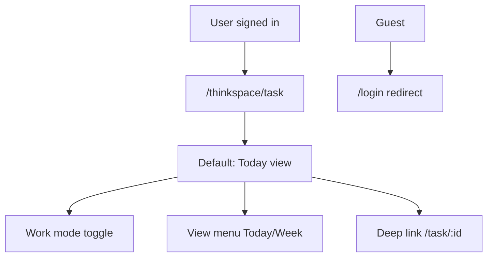
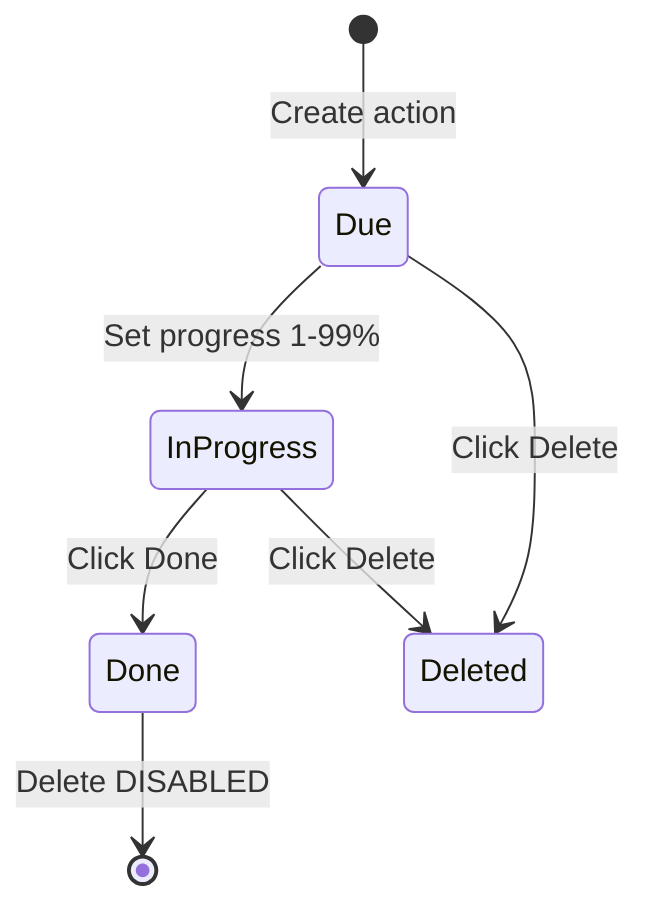

# Action Module — Detailed Workflow & Testing Guide

> **Audience:** QA, automation engineers, trainers  
> **Product:** Thinkspace → **Action Master** (UI label: Actions)  
> **Route:** `/thinkspace/task` · **License:** `thinkspace-task`

This document explains how the Action module works in the product, how user workflows map to CRUD operations, and how to test them (manual or automated).

**Related files:**

| Asset | Path |
|-------|------|
| Workflow catalog (machine-readable) | `src/data/thinkspace/action-test-workflows.json` |
| Test case matrix (36 cases) | `src/data/thinkspace/actions-test-matrix.json` |
| Test datasets | `src/data/thinkspace/actions-test-data.json` |
| Demo flow (video) | `src/data/thinkspace/action-flow-demo.json` |
| Product/API reference | `docs/THINKSPACE_ACTIONS_FLOW.md` |
| Flow analysis | `docs/THINKSPACE_ACTION_MASTER_ANALYSIS.md` |

---

## 1. What is the Action Module?

The Action module is the primary workspace where users **capture ideas**, **create tasks (actions)**, **track progress**, and **complete or delete** work items.

| Concept | Product term | Technical |
|---------|--------------|-----------|
| Module name | Action Master | `thinkspace-task` license |
| UI label | Actions | i18n `flows.thinkspace.task` |
| Main entity | Action | `ThinkspaceTask` (API: `tasks/`) |
| Idea capture | Bucketlist | `bucket-list/` |
| Detail view | Detail modal | URL `/thinkspace/task/:id` |

**Out of scope for Action-only testing:** Agenda creation (section H), Metalk actions page, Thought workspace, Action pool / Timesheet admin views.

---

## 2. Screen map

```
┌─────────────────────────────────────────────────────────────────┐
│  Header: Work mode │ View menu (Today/Week) │ Filters (optional) │
├──────────────┬──────────────────────────────────────────────────┤
│  Bucketlist  │  Action list (Today columns or Week calendar)    │
│  (side panel)│  Row click → opens detail modal                  │
│  FAB toggle  │                                                  │
├──────────────┴──────────────────────────────────────────────────┤
│  Quick-create modal (overlay) — Specific / Routine / Agenda     │
└─────────────────────────────────────────────────────────────────┘

Detail modal (/thinkspace/task/:id):
┌────────────────────────────────────────┐
│ Title │ Close                          │
│ Description (editable)                 │
│ Tabs: Progress | Updates | Attachments | Hierarchy │
│ Actions: Done | Delete                   │
└────────────────────────────────────────┘
```

---

## 3. User personas & access

| Persona | Can access `/thinkspace/task`? | Typical tests |
|---------|-------------------------------|---------------|
| Guest (no session) | No → `/login` | N-A01 |
| Signed-in, no license | No → `/403` | N-A02 (manual; needs denied user) |
| Licensed ERP user | Yes | All positive workflows |
| Assignee | Read + progress | P-E03, P-F01 |
| Assigner | Full edit + delete | P-E02, P-F04 |

**Automation user:** `E2E_ERP_USERNAME` / `E2E_ERP_PASSWORD` in `testing/.env`  
**Tenant URL:** use nip.io host (e.g. `http://maithan-orch-warehouse.127.0.0.1.nip.io:8002`), not `localhost`.

---

## 4. Core workflows (testing paths)

Each workflow has an ID in `action-test-workflows.json`. Run automated specs or follow steps manually.

### 4.1 Entry & navigation (Section A)



| Workflow ID | What to test | Matrix | Spec |
|-------------|--------------|--------|------|
| WF-AUTH-01 | Guest blocked | N-A01 | `01-access-navigation` |
| WF-AUTH-02 | Workspace loads | P-A01 | `01-access-navigation` |
| WF-NAV-01 | Today ↔ Week | P-A02 | `01-access-navigation` |
| WF-NAV-02 | Agenda/Action mode | P-A03 | `01-access-navigation` |
| WF-NAV-03 | Deep link detail | P-A04 | `01-access-navigation` |

**Validation checklist (WF-AUTH-02):**
- [ ] URL contains `/thinkspace/task`
- [ ] Work mode group visible (`aria-label="Work mode"`)
- [ ] View menu shows `Actions · Today` or `Week`
- [ ] No redirect to `/403`

---

### 4.2 Bucketlist (Section B)

**Purpose:** Capture unstructured ideas before converting to formal actions.

| Step | User action | API | Expected |
|------|-------------|-----|----------|
| 1 | Click FAB "Open bucketlist" | — | Panel opens |
| 2 | Type in "What's on your mind?" → Enter | `POST bucket-list/` | Row appears |
| 3 | Click **Specific** or **Routine** on row | — | Quick-create opens, title prefilled |
| 4 | Click **✕** on row | `DELETE bucket-list/:id/` | Row removed |

| Workflow ID | Matrix cases | Negative |
|-------------|--------------|----------|
| WF-BUCKET-01 | P-B01, P-B02 | — |
| WF-BUCKET-02 | P-B03, P-C01 | — |
| WF-BUCKET-03 | P-B04 | — |
| WF-BUCKET-04 | P-B06 | — |
| WF-BUCKET-N01 | N-B01 | Whitespace-only rejected |

**Test data:** TS-A03 (`E2E Bucket — Plan Q3 safety audit`)

---

### 4.3 Create action (Section C)

**Primary path:** Bucketlist → Specific → Quick-create → **+ Create Action**

| Field | Required | Validation |
|-------|----------|------------|
| Title | Yes | Empty → Create disabled (N-C01) |
| Start date | Yes (defaults) | — |
| Assignee | Yes (defaults to self) | — |
| Description | No | Persisted as `task_details` (P-C03) |
| Type | Specific / Routine | Routine = recurring series |

| Workflow ID | Goal | Matrix |
|-------------|------|--------|
| WF-BUCKET-02 | Create Specific (happy path) | P-C01 |
| WF-CREATE-01 | With description | P-C03 |
| WF-CREATE-N01 | No title | N-C01 |
| WF-CREATE-N02 | Cancel | N-C08 |

**Success signals:**
- Toast: `Action created.`
- Modal closes
- Action appears in Today list (may need brief wait/reload)

**Test data:** TS-A01, TS-A07

---

### 4.4 Read from list (Section D)

| Step | Action | Expected |
|------|--------|----------|
| 1 | Ensure action exists in Today view | Row visible |
| 2 | Click row (button with title text) | URL → `/thinkspace/task/:id` |
| 3 | — | Detail modal opens with title |

**Workflow:** WF-READ-01 (P-D01) · Spec: `04-read-list.ui.spec.ts`

---

### 4.5 Detail modal — read & update (Section E)

| Tab | What user does | API |
|-----|----------------|-----|
| **Progress** | Slider + Save; Done button | `set-task-progress/`, status update |
| **Updates** | Post comment | `post-task-update/` |
| **Attachments** | Upload files | `add-attachment-to-task/` |
| **Hierarchy** | View subactions tree | `get-task-hierarchy/` |

| Workflow ID | Action | Matrix |
|-------------|--------|--------|
| WF-DETAIL-01 | Visit all tabs | P-E01 |
| WF-UPDATE-01 | Edit description | P-E02 |
| WF-UPDATE-02 | Set progress % | P-E03 |
| WF-UPDATE-03 | Post update | P-E04 |
| WF-UPDATE-N01 | Empty post blocked | N-E01 |

**Manual test tip:** After P-E02, reload page and confirm description persisted.

---

### 4.6 Lifecycle — Done & Delete (Section F)



| Workflow ID | Action | Matrix | Note |
|-------------|--------|--------|------|
| WF-LIFE-01 | Mark Done | P-F01 | Delete disabled after |
| WF-LIFE-02 | Delete only | P-F04 | Action must not be Done |
| WF-LIFE-03 | Full CRUD E2E | P-F05 | Create → update → delete |

**Critical rule for testers:** Do **not** mark Done then try Delete on the **same** action. Use separate records for P-F01 vs P-F04/P-F05.

**Demo video** (`npm run demo:thinkspace-action`) follows WF-LIFE-03 pattern without Mark Done.

---

### 4.7 Week navigation (Section G)

| Step | Action | Expected |
|------|--------|----------|
| 1 | View menu → Week | `?view=week` in URL |
| 2 | Verify Previous week / Next week buttons | Visible |
| 3 | Click Previous, then Next | Stays in week view |

**Workflow:** WF-WEEK-01 (P-G01, P-G02) · Spec: `07-week-view.ui.spec.ts`

---

## 5. CRUD summary

| Entity | Create | Read | Update | Delete |
|--------|--------|------|--------|--------|
| **Bucket item** | Enter in bucketlist | Panel list | — | ✕ button |
| **Action** | Quick-create / API | List row, deep link | Description, progress, notes, Done | Delete button |
| **Progress note** | Post update | Updates tab | — | — |

**API base:** `/api/v1/thinkspace/`

| Operation | Endpoint |
|-----------|----------|
| List/create actions | `GET/POST tasks/` |
| Action detail | `GET/PATCH tasks/:id/` |
| Progress | `POST tasks/set-task-progress/` |
| Post update | `POST tasks/post-task-update/` |
| Delete | `POST tasks/delete-task/` |
| Bucket | `GET/POST bucket-list/` |

---

## 6. Recommended test execution order

For **manual exploratory testing** or **onboarding**, follow this sequence (matches `recommendedExecutionOrder` in JSON):

1. **Access** — WF-AUTH-02, WF-NAV-01, WF-NAV-02  
2. **Create path** — WF-BUCKET-01 → WF-BUCKET-02 → WF-CREATE-01  
3. **Read** — WF-READ-01, WF-NAV-03  
4. **Update** — WF-DETAIL-01 → WF-UPDATE-01 → WF-UPDATE-02 → WF-UPDATE-03  
5. **Lifecycle** — WF-LIFE-03 (full E2E), then WF-LIFE-01 and WF-LIFE-02 on **separate** actions  
6. **Week** — WF-WEEK-01  
7. **Negatives** — WF-BUCKET-N01, WF-CREATE-N01, WF-CREATE-N02, WF-UPDATE-N01  
8. **Guest** — WF-AUTH-01  

---

## 7. Automation mapping

### Run commands

```powershell
cd d:\maithanerp\testing

# Full suite (login + thinkspace workflow)
npm test

# Action module only (authenticated)
npx playwright test tests/thinkspace/workflow --project=erp-authenticated

# Single section
npx playwright test tests/thinkspace/workflow/03-create-action.ui.spec.ts --project=erp-authenticated

# Demo video (WF-LIFE-03 extended)
npm run demo:thinkspace-action
```

### Spec ↔ section map

| Spec file | Section | Workflows covered |
|-----------|---------|-------------------|
| `01-access-navigation.ui.spec.ts` | A | WF-AUTH-*, WF-NAV-* |
| `02-bucketlist.ui.spec.ts` | B | WF-BUCKET-* |
| `03-create-action.ui.spec.ts` | C | WF-CREATE-*, WF-BUCKET-02 |
| `04-read-list.ui.spec.ts` | D | WF-READ-01 |
| `05-detail-update.ui.spec.ts` | E | WF-DETAIL-01, WF-UPDATE-* |
| `06-lifecycle.ui.spec.ts` | F | WF-LIFE-* |
| `07-week-view.ui.spec.ts` | G | WF-WEEK-01 |
| `demo/action-module-flow.ui.spec.ts` | A–F | WF-LIFE-03 + nav + tabs |

### Coverage snapshot

| Type | Count | Automated |
|------|-------|-----------|
| Positive (Action A–G) | 24 | 24 |
| Negative (Action A–G) | 4 | 4 |
| Agenda (H) | 8 | 8 (separate spec `08-create-agenda`) |
| License denied (N-A02) | 1 | 0 (needs `E2E_THINKSPACE_DENIED_USER`) |

---

## 8. Test data reference

| Dataset ID | Used for | Matrix |
|------------|----------|--------|
| TS-A01 | Standard Specific create | P-C01, P-F05 |
| TS-A02 | Deep link / high priority | P-A04 |
| TS-A03 | Bucket capture | P-B01 |
| TS-A04 | Progress / Done | P-E03, P-F01 |
| TS-A05 | Empty title negative | N-C01 |
| TS-A06 | Routine action | P-B04 |
| TS-A07 | Rich description | P-C03 |
| TS-A10 | Delete lifecycle | P-F04 |

Titles are prefixed with `E2E` and timestamped in automation to avoid collisions.

---

## 9. Prerequisites checklist

Before running Action module tests:

- [ ] Django backend on `:8001`
- [ ] UI dev server on `:8002`
- [ ] `testing/.env` with tenant URL, username, password
- [ ] User has `thinkspace-task` license
- [ ] `npm run setup` completed once in `testing/`
- [ ] Auth storage: created automatically by `erp-auth.setup.ts`

---

## 10. Reporting

| Report | Command |
|--------|---------|
| Playwright HTML | `npm run report` |
| Allure (MaithanErp branded) | `npm run report:allure:open` |
| Artifacts | `test-results/` (screenshots, videos, traces) |

Allure hierarchy: **Thinkspace module → Action Master → section A–H**

---

## 11. Gaps & future tests

| Gap | Priority | Notes |
|-----|----------|-------|
| N-A02 License denied | P0 | Needs dedicated user in `.env` |
| Attachments upload | P2 | Tab exists (P-E01); no dedicated upload case yet |
| Routine recurrence validation | P2 | P-B04 opens modal; full save path partial |
| Subactions / Hierarchy create | P3 | Hierarchy tab read-only in current matrix |
| Action type filters | P2 | Filter bar present; no matrix cases yet |
| Guided work mode | P3 | Third work mode option |

---

## 12. Quick reference — one-page happy path

```
Sign in (tenant URL)
  → /thinkspace/task
  → Work mode: Agenda/Action (optional)
  → Bucketlist: type idea → Enter
  → Row: Specific → fill form → + Create Action
  → Today list: click new action
  → Detail: edit description → Save
  → Progress tab: 75% → Save
  → Post progress note
  → Delete
```

**Automated equivalent:** `npm run demo:thinkspace-action` or WF-LIFE-03 in `06-lifecycle.ui.spec.ts`.
