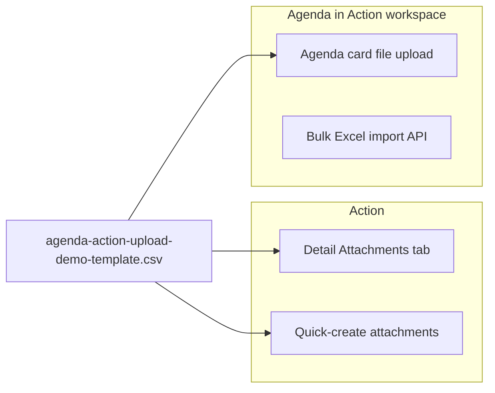

# Thinkspace Agenda / Action — Upload for Testing

> **Scope:** Upload flows inside **Thinkspace** only (`/thinkspace/task`).  
> Your handwritten column list is the **demo upload file layout** for QA — not a separate ERP module.

---

## 1. Demo upload file (from your image)

| Asset | Path |
|-------|------|
| CSV template (1 sample row) | `src/data/demo/agenda-action-upload-demo-template.csv` |
| Column spec (25 fields) | `src/data/demo/agenda-action-upload-demo-spec.json` |

Use this file when testing **upload in Agenda or Action**:

1. **Action — Attachments tab** (automated `P-I02`): open action → Attachments → upload the demo CSV  
2. **Action — quick-create**: add demo CSV via `#create-attachments-input` before save (`P-C04`)  
3. **Agenda — card attachment**: upload on an agenda row when testing Agenda/Action mode  
4. **Agenda — bulk Excel** (when UI shows Bulk import): separate agenda template API; your demo CSV is for document upload / future action bulk

---

## 2. Upload paths in Action / Agenda module



| ID | Where | Matrix | Automated |
|----|-------|--------|-----------|
| P-E05 | Any small file on Attachments tab | I | yes (generic txt) |
| **P-I02** | **Demo CSV on Attachments tab** | I | **yes** |
| P-C04 | Demo CSV in quick-create | I | manual |
| P-AG07 | Agenda bulk Excel (agenda_ref columns) | I | manual — button hidden in compact Action view |

---

## 3. How to run upload tests

```powershell
cd d:\maithanerp\testing
npx playwright test tests/thinkspace/workflow/09-upload-workflows.ui.spec.ts --project=erp-authenticated
```

---

## 4. Manual test with demo file

1. Sign in → `/thinkspace/task`  
2. Create or open an action  
3. Attachments tab → browse → select `agenda-action-upload-demo-template.csv`  
4. Upload → confirm filename appears in list  

For **Agenda/Action** mode: switch work mode → attach same file on an agenda card if testing agenda upload UX.

---

## 5. Related docs

- [ACTION_MODULE_TEST_WORKFLOW.md](./ACTION_MODULE_TEST_WORKFLOW.md) — full CRUD workflows A–H  
- [THINKSPACE_ACTIONS_FLOW.md](./THINKSPACE_ACTIONS_FLOW.md) — APIs and selectors
