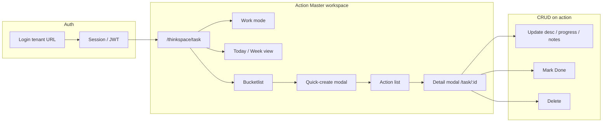

# Thinkspace Action Master — Flow Analysis

> **Purpose:** Understand how the real product flow maps to automation (matrix cases, POMs, demo video).  
> **Route:** `/thinkspace/task` · **License:** `thinkspace-task` · **UI label:** Actions

---

## 1. High-level user journey



| Phase | User sees | Automation section |
|-------|-----------|-------------------|
| Enter module | Actions workspace, Today view | **A** Access & navigation |
| Capture ideas | Bucketlist side panel | **B** Bucketlist |
| Create action | Quick-create Specific/Routine | **C** Create action |
| Find action | Today/Week list rows | **D** List & filters |
| Work on action | Detail modal tabs | **E** Detail modal |
| Finish / remove | Done or Delete | **F** Lifecycle |
| Calendar scope | Week prev/next | **G** Week navigation |
| Agendas (separate) | Agenda column + modal | **H** Create agenda |

---

## 2. CRUD mapping (Action entity)

| CRUD | UI path | API (Django) | Matrix examples |
|------|---------|--------------|-----------------|
| **Create** | Bucketlist → Specific → Quick-create | `POST /thinkspace/tasks/` | P-C01, P-B03 |
| **Read** | List row click, deep link `/task/:id` | `GET /thinkspace/tasks/:id/` | P-D01, P-A04 |
| **Update** | Description, progress %, post update | `PATCH`, `set-task-progress`, `post-task-update` | P-E02, P-E03, P-E04 |
| **Delete** | Detail → Delete | `POST delete-task/` | P-F04, P-F05 |
| **Update (status)** | Detail → Done | Progress → 100% / done state | P-F01 |

**Important:** After **Mark Done**, the **Delete** button is disabled. Full demo video uses **Update → Delete** (P-F05), not Done + Delete on the same record.

---

## 3. Demo video ↔ matrix alignment

Config: `src/data/thinkspace/action-flow-demo.json`  
Spec: `tests/thinkspace/demo/action-module-flow.ui.spec.ts`  
Command: `npm run demo:thinkspace-action`

| Step | Demo action | Matrix case(s) | CRUD |
|------|-------------|----------------|------|
| 1 | Open `/thinkspace/task` | P-A01 | Read |
| 2 | Work mode → Agenda/Action (active) | P-A03 | Read |
| 3 | Action type filter → Specific | P-D02 | Read |
| 4 | View menu → Week | P-A02, P-G01 | Read |
| 5 | Previous week → Next week | P-G02 | Read |
| 6 | View menu → Today | P-A02 | Read |
| 7 | Open bucketlist FAB | P-B02 | Read |
| 8 | Bucketlist add item | P-B01 | Create |
| 9 | Routine preview → Cancel | P-B04 | Create |
| 10 | Specific quick-create | P-C01, P-B03 | Create |
| 11 | Deep link `/thinkspace/task/:id` | P-A04 | Read |
| 12 | Tabs: Progress, Updates, Attachments, Hierarchy | P-E01 | Read |
| 13 | Update description + 30% progress | P-E02, P-E03 | Update |
| 14 | Do more (with note prompt) | P-F02 | Update |
| 15 | Derailed (with note prompt) | P-F03 | Update |
| 16 | Post progress note | P-E04 | Update |
| 17 | Upload attachment | P-E05, P-I02 | Update |
| 18 | Second action → Done → verify 100% | P-F01 | Update |
| 19 | Delete primary action | P-F04, P-F05 | Delete |
| 20 | Cleanup leftover bucket item | P-B06 | Delete |

**Not in Action demo video (separate specs):**

- **H** Agenda create → `08-create-agenda.ui.spec.ts`
- **P-F01** Mark Done → `06-lifecycle.ui.spec.ts` (use before delete, or separate action)

---

## 4. Page objects (automation layer)

| POM | File | Responsibility |
|-----|------|----------------|
| `TaskPage` | `src/pages/thinkspace/TaskPage.ts` | Workspace, bucketlist, view menu, list navigation, agenda header |
| `TaskDetailModal` | `src/pages/thinkspace/TaskDetailModal.ts` | Tabs, description, progress, post update, done, delete |
| `QuickCreateModal` | via `taskPage.quickCreate` | Create action/agenda forms |
| `WorkModeToggle` | `taskPage.workMode` | Agenda/Action, Guided, Specific/Routine |

---

## 5. Test suite structure

```
tests/thinkspace/
├── demo/
│   └── action-module-flow.ui.spec.ts   ← one video, full Action CRUD story
└── workflow/
    ├── 01-access-navigation.ui.spec.ts    # A
    ├── 02-bucketlist.ui.spec.ts             # B
    ├── 03-create-action.ui.spec.ts          # C
    ├── 04-read-list.ui.spec.ts              # D
    ├── 05-detail-update.ui.spec.ts          # E
    ├── 06-lifecycle.ui.spec.ts              # F (Done, Delete, P-F05)
    ├── 07-week-view.ui.spec.ts              # G
    └── 08-create-agenda.ui.spec.ts           # H
```

**Matrix catalog:** `src/data/thinkspace/actions-test-matrix.json` (36 automated cases)  
**Allure hierarchy:** Thinkspace module → Action Master → section A–H

---

## 6. Prerequisites for recording / running

1. **Tenant URL** — `http://<slug>.127.0.0.1.nip.io:8002` (not `localhost`)
2. **Stack** — Django `8001`, Vite UI `8002`
3. **Credentials** — `E2E_ERP_USERNAME`, `E2E_ERP_PASSWORD` in `testing/.env`
4. **License** — user must have `thinkspace-task` access
5. **Auth storage** — created by `tests/setup/erp-auth.setup.ts`

---

## 7. Commands

| Goal | Command |
|------|---------|
| Record Action flow video | `npm run demo:thinkspace-action` |
| All workflow tests | `npm test` or `npm run test:playwright` |
| Single section (e.g. lifecycle) | `npx playwright test tests/thinkspace/workflow/06-lifecycle.ui.spec.ts --project=erp-authenticated` |
| Playwright HTML report | `npm run report` |
| Allure MaithanErp report | `npm run report:allure:open` |

**Video output:** `testing/test-results/<run>/video.webm`  
**Trace replay:** `npx playwright show-trace test-results/.../trace.zip`

---

## 8. Related docs

- [ACTION_MODULE_TEST_WORKFLOW.md](./ACTION_MODULE_TEST_WORKFLOW.md) — detailed workflows, CRUD, manual test order, automation map
- [THINKSPACE_ACTIONS_FLOW.md](./THINKSPACE_ACTIONS_FLOW.md) — routes, API, selectors, permissions
- [PROJECT_ANALYSIS.md](./PROJECT_ANALYSIS.md) — full testing project overview
