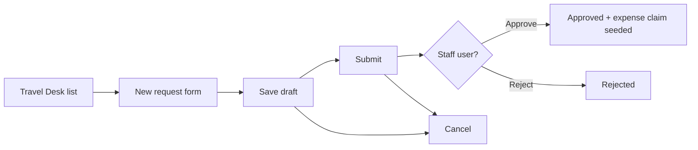

# Thinkspace Travel — Test Workflow

Playwright UI automation for **Thinkspace → Travel** (Travel Desk) at `/thinkspace/travel`.

## Demo video (full workflow)

Records a **17-step** headed walkthrough covering every Travel Desk UI surface:

```bash
npm run demo:thinkspace-travel
```

Step definitions: `src/data/thinkspace/travel-flow-demo.json`  
Spec: `tests/thinkspace/demo/travel-module-flow.ui.spec.ts`

### Demo steps at a glance

| Step | Section | What it demonstrates |
|------|---------|----------------------|
| 1 | A | Open Travel Desk — list loads via API |
| 2 | F | Empty state or existing request cards |
| 3 | B | Toggle **New request** inline form |
| 4 | G | Required-field guard — empty save blocked |
| 5 | B | **Save draft** with leg + notes → `POST travel/requests/` |
| 6 | F | Row shows destination, dates, status, leg line |
| 7 | C | **Submit** Draft → Submitted |
| 8 | D | Staff **Approve** → Approved + expense claim seeded |
| 9–10 | B/C | Second request create + submit |
| 11 | D | Staff **Reject** → Rejected |
| 12 | G | Invalid **Cancel** on Rejected → error alert |
| 13 | B | **Close** form without saving (abandon) |
| 14–15 | B/E | Third request → **Cancel** from Draft |
| 16 | A | **Back** to Thinkspace hub |
| 17 | A | Return to Travel — final list with all statuses |

## Routes

| Route | Page | Purpose |
|-------|------|---------|
| `/thinkspace/travel` | TravelHubPage | List, create draft, submit, approve/reject, cancel |

## Workflow (product)



| Status | UI actions (requester) | UI actions (staff) |
|--------|------------------------|---------------------|
| Draft | Submit, Cancel | Submit, Cancel |
| Submitted | Cancel | Approve, Reject, Cancel |
| Approved | Cancel | Cancel |
| Rejected | Cancel (API blocks invalid transition) | — |
| Cancelled | — | — |

**License:** `thinkspace-travel` · **API:** `/api/v1/thinkspace/travel/requests/`

## Coverage

| Section | Spec file | Cases |
|---------|-----------|-------|
| A. Access & navigation | `01-access-navigation.ui.spec.ts` | P-TR01–P-TR02, N-TR01 |
| B. Create draft | `02-create-draft.ui.spec.ts` | P-TR03–P-TR05, N-TR03–N-TR04 |
| C. Submit workflow | `03-submit-workflow.ui.spec.ts` | P-TR06–P-TR07 |
| D. Approval (staff) | `04-approval.ui.spec.ts` | P-TR08–P-TR09 |
| E. Cancel lifecycle | `05-cancel-lifecycle.ui.spec.ts` | P-TR10–P-TR12, N-TR08 |
| F. List & read | `06-list-read.ui.spec.ts` | P-TR13–P-TR14, P-TR16 |

## Run commands

```bash
# All Travel tests (authenticated + guest)
npm run test:travel

# Positive / negative only
npm run test:travel:positive
npm run test:travel:negative

# Single section
npx playwright test tests/thinkspace/travel/02-create-draft.ui.spec.ts --project=erp-authenticated
```

Requires ERP auth setup (`storage/erp-auth.json`) and stack running on tenant URL from `testing/.env`.

**Staff-only cases (P-TR08, P-TR09, P-TR16, N-TR08 setup):** default `E2E_ERP_USERNAME` must be a staff user or those tests skip.

## Key files

| File | Purpose |
|------|---------|
| `src/pages/thinkspace/TravelPage.ts` | Page object (form, list, row actions) |
| `src/api/ThinkspaceTravelApi.ts` | API helpers for verify/cleanup |
| `src/data/thinkspace/travel-test-matrix.json` | Test case matrix |
| `src/fixtures/travel.ts` | Travel fixture + auto cleanup (cancel) |

## Excluded from default automation

| Feature | Reason |
|---------|--------|
| Booked / Completed status | No UI or API action exposed |
| Bookings / travel expenses UI | API only |
| N-TR06 non-staff approval UI | Needs dedicated non-staff user in `.env` |
| P-TR13 empty state | Skips when list already has rows |
| Delete travel request | No delete API — cleanup uses cancel |

## Locator strategy

No `data-testid` in Travel UI. Use:

- Heading `Travel Desk`
- Buttons: `New request`, `Close`, `Save draft`, `Submit`, `Approve`, `Reject`, `Cancel`
- Labels: `Title`, `Destination`, `Start date`, `End date`, `From (leg)`, `To (leg)`
- Rows: `role=article` filtered by title text
